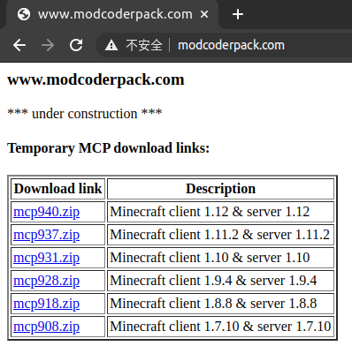

# Forge的历史

## 早期的Minecraft Mod与Forge的诞生

早在Minecraft刚刚发布的年代，就已经有了Mod。

因为Minecraft是用Java编写的，所以Minecraft的代码**相对容易修改**，因此，早期的Mod诞生了。显而易见，早期的Mod是**通过底层直接对Minecraft进行修改**实现的。由此引发的问题有很多，最明显的就是Mod的**并存问题**。想要添加多个Mod，就需要玩家**将代码一行一行地进行合并**，难度可想而知。

随着**MCP (Mod Coder Pack) **的诞生，Minecraft Mod的开发变得更加容易。因为Minecraft作为**商业软件**，而Java编写的程序又相对容易被**反编译 (Decompile)**，因此Mojang对源代码进行了混淆。而MCP团队将Minecraft进行了**反混淆**。过去，Mod作者要对着一堆反人类的类名、方法名编写Mod；现在，使用MCP提供的源码就可以进行Mod制作，MCP还支持将Mod打包等。

但是很显然，Mod并存的难题依旧没有得到解决。

直到2010年底，一款叫**ModLoader**的Mod横空出世。它提供了一个**框架 (Frame) **和一套**API (Application Program Interface) **，这有点像今天的Forge。玩家通过这套框架可以很方便地管理Mod，而开发者可以通过这套API完成很多任务。但如果想要自己的Mod拥有更强大的功能，还是需要通过底层修改Minecraft。

2010年圣诞节前夕，Mojang开始发布Minecraft的Beta版本，Minecraft Mod的 “黄金时期” 开始了。这一期间，很多今天耳熟能详的Mod，就是这一时期被开发出来的，例如：RailCraft (铁路)、IndistrialCraft (工业时代)、BuildCraft (建筑) ~~(虽然这些Mod都停滞在了1.12.2版本)~~。“黄金时期” 直到2011年底Mojang开始发布Minecraft的正式版才结束，共约1年时间。

Modder们看到Mod的并存依旧十分困难，便发起了**Forge计划**，也就是今天的Forge。到了后来，他们甚至还将ModLoader整合进了Forge中，也就是**FML (Forge Mod Loader)**。

## Forge今天的发展

直到今天，Forge在Minecraft Mod的API中仍占有举足轻重的地位，即使是LiteLoader和Fabric都无法撼动它的地位。但今天和过去相比，有了些许变化。到了今天，虽然Forge提供给开发者的Minecraft源代码表面上仍然由MCP团队反编译的，但实际上MCP团队在今天已经名存实亡。几年过去了，打开[MCP官网](http://www.modcoderpack.com/)，看到的仍然是一行 “under construction” 的字样，但我们从这个简单的网页，便足以想象出当年的辉煌。  

作为新的Modder，我们应该向这些开发者们致敬。是他们，创造了今天的辉煌。