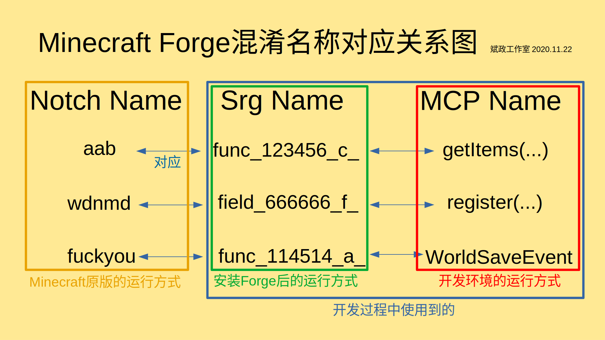

# 游戏混淆机制与运行

## 混淆与反混淆

看完上一节，你应该知道了Minecraft的源代码是混淆过的，而MCP对Minecraft源码进行了反混淆。为了避免法律责任，Forge便采用了特殊的混淆机制，于是，**『Notch Name』**、**『Srg Name』**与**『MCP Name』**便诞生了。

**Notch Name**就是**被Mojang混淆后的Minecraft源码**，这个不用多说。**MCP Name**则是开发者开发Mod时接触的名称，例如`Item`、`Block`等。而**Srg Name**则相对复杂，它是为了纪念MCP项目领导者**Searge**而得名的。它与Notch Name呈**一一对应**的关系，在一个大版本中是不会变化的，即使是不同的大版本也区别不大，它**主要**以`field`或`func`开头。它是处于Notch Name与MCP Name之间的，下面一张图反应了这三者的关系。

开发者开发Mod时，仅仅能知道Srg Name与MCP Name的映射关系，而无法知道Notch Name与另外两种名称的映射关系。而玩家若刻意反编译**安装Forge后**的Minecraft，仅仅能看到Srg Name。使用这种混淆方法，有效保证了Minecraft源代码不会因此而泄露，保护了Minecraft的版权，避免了法律责任。

当然，**代码的反混淆需要一定的时间**。如果等Minecraft的代码全部完成反混淆再发布MCP，那样就太慢了。因此，为了MCP的及时更新，有时候他们会**直接把Srg Name扔进开发环境的源代码中** (如下图所示)。  

当然，**随着MCP的更新，会有更多Srg Name被反混淆成MCP Name**。其次，**一些MCP Name是会随更新而变动的**，因为MCP Name有时会出现描述不准确的情况，需要更改。

## 三种混淆名称与游戏运行

### 开发环境的运行与Mod构建

我们知道，我们是用MCP Name开发Mod的，而Forge提供的Minecraft源码也是以MCP Name为主。自然地，**我们在开发环境测试Mod时，也是直接以MCP Name运行的**。不然各种混淆名称转换来转换去，不免过于繁琐。

而我们在构建Mod (`gradlew build`) 时，Forge会自动地将其中的MCP Name替换成相应的Srg Name (重混淆)。

### 玩家端的运行方式

在Minecraft纯净版，自然是用Notch Name运行的。而安装了Forge就不同了，Forge在安装时，直接调用`SpecialSource`，将原版的Notch混淆的Minecraft核心文件反混淆成Srg混淆的核心文件。(仅1.13以上版本)

也就是说，最终的游戏是以Srg Name运行的。