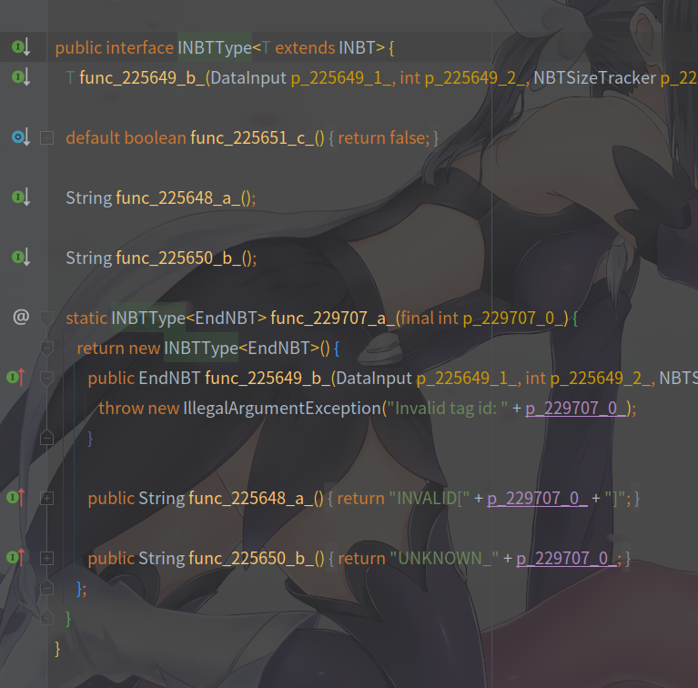

# 混淆与反混淆

看了**1.1章节**，读者应该都知道了Minecraft的代码是混淆过的。且Minecraft作为商业软件，源代码肯定不能随意泄漏，既然MCP将Minecraft的源码进行了反混淆，那肯定要采取对应的策略以应对版权问题。于是，**Notch Name、Srg Name与MCP Name**就这样诞生了。

首先就是**Notch Name**，Notch Name其实就是Minecraft混淆后的名称，这并没有什么好说的。

**Srg Name**，之所以叫Srg Name，是为了纪念MCP项目的领导者Searge而取名的。它与Notch Name是**一一对应**的。且在一个版本里是不会变动的，即使是不同的Minecraft版本也差别不大。Srg Name**主要**以`field`或`func`开头，**一般唯一**。

而我们在开发时使用的是**MCP Name**，也就是诸如`Block`、`Item`这样的名称，这和普通Java程序没什么两样。

但有时你开发时看到的不一定全都是MCP Name。因为代码的反混淆需要时间，而Minecraft的代码量极大，为了能更快地发布新版本的Forge，有时候他们会**直接把未反混淆Srg Name扔进开发环境提供的Minecraft源码中**（如下图）。当然，**随着MCP的更新，会有更多Srg Name被反混淆成MCP Name**。  

其次，MCP Name是会**经常变动**的，因为MCP Name有时会出现描述不准确的情况。

## Forge如何处理三种混淆名称

首先，我们是使用MCP Name开发Mod的，**开发环境中的Minecraft也是以MCP Name运行的**。而Forge在构建Mod时，**会将其中的MCP Name替换为对应的Srg Name**（即**重混淆**）。

而Forge在安装时，直接调用`SpecialSource`，**生成srg混淆的Minecraft核心文件**。

也就是说，最终的游戏是按照**Srg Name**运行的。

---

参考文献： 
<a link="https://fmltutor.ustc-zzzz.net/%E9%99%84%E5%BD%95C-%E6%B7%B7%E6%B7%86%E4%B8%8E%E5%8F%8D%E5%B0%84.html">《FMLTutor》</a>，作者：zzzz 
<a link="https://xfl03.gitbook.io/coremodtutor/4-fml-coremod/4.3#1-13-2-1-152-fml-coremod-da-shi-ji">《1.13.2-1.15.2 FML CoreMod大事记》</a>，作者：xfl03

