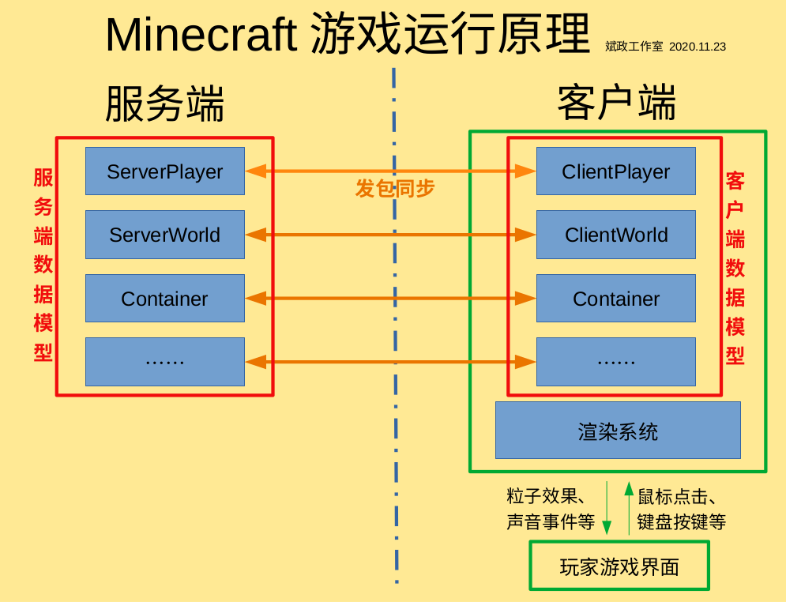

# 客户端与服务端

## 客户端与服务端概述

Minecraft的运行分为**『客户端』**与**『服务端』**。客户端全称**『逻辑客户端』**负责**界面渲染**、**将玩家在客户端的操作反馈到服务端**等；服务端全称**『逻辑服务端』**负责**数据处理**、**游戏逻辑等**。

在多人游戏时，这就很好理解。**远程服务器运行服务端，本地运行客户端**。客户端将我们的操作通过**网络发包**反馈到服务端，服务端将操作处理后返回给客户端。单人游戏也是一样的道理，只不过二者同时存在于你的计算机中，**他们位于不同的线程** (服务端位于『Server Thread』，客户端位于『Render Thread』，如果你分析过Minecraft的运行日志，你一定对此不陌生)。

实际上，客户端与服务端的区别仅仅是逻辑上的。下面一张图反映了二者的关系。



看完这张图，你或许会产生疑问。我们刚刚说客户端负责画面渲染，怎么在这张图里，客户端还有`ClientPlayer`、`ClientWorld`之类的乱七八糟的东西？其实这些只是服务端对应的数据模型的**副本**。因为客户端也需要数据模型供玩家操作，然后将被玩家的操作修改后的数据同步到服务端。这两个数据模型有各自独立的Tick和数据，但最终还是以服务端的数据为准。

## 物理客户端与物理服务端

在客户端与服务端之外，我们还要引入**『物理客户端』**与**『物理服务端』**的概念。

**注意：以下的内容与上面的内容没有直接联系，不要与上面的内容混淆！**

物理客户端，之所以最前面加上了『物理』两个字，就说明这里的客户端与上文的客户端不一样了。它不是逻辑上的客户端，而是实实在在的客户端，也就是**我们平时运行的游戏**。而物理服务端也是一样的道理，即**服务器上运行的服务端**。

为什么要引入这两个概念呢？根据我的开发经验，一样**有问题**的代码，在**逻辑服务端**上执行的错误表现与在**物理服务端**上执行的错误表现是不同的。前者可能只是报错，而后者可能直接崩溃，或者出现其他表现。**逻辑客户端**与**逻辑服务端**也是一样的道理。如果全部笼统地称作『客户端』或『服务端』，就容易混淆。因此，为了加以区分，我们便引入这两个概念。

例如，**在物理服务端是没有与渲染相关的类的**，如果**在物理服务端中运行涉及渲染的代码，就会导致崩溃**。虽然在物理客户端中的逻辑服务端也不能运行，但一般只会报错，而不会导致崩溃。

## 代码上如何区分他们

### 区分逻辑客户端与逻辑服务端

在`World`中有个布尔类型的变量，叫`isRemote`，这是区分**逻辑客户端与逻辑服务端**的最常用方法。当目前的世界是`ClientWorld`时，该字段为**`false`**，当目前的世界是`ServerWorld`时，该字段为**`true`**。

代码示例：  
```java
if (world.isRemote) {
	(要运行的代码)
}
```

### 区分物理客户端与物理服务端

在`FMLEnvironment`类中有一个变量`dist`，`dist`里有两个方法，分别为`isClient()`和`isDedicatedServer()`。他们的用途这里就不多说了。

代码示例：  
```java
if (FMLEnvironment.dist.isClient) {
	(要运行的代码)
}
```

## 一些注意事项

既然客户端与服务端的职责不同，相关数据模型也不同，那么为了确保你的Mod能够同时兼容物理客户端与物理服务端，请注意以下几点：

* **服务端没有渲染相关的类**，因此请不要在服务端调用任何涉及渲染的类。
* 给只能在客户端运行的类与方法加上**`@OnlyIn(Dist.CLIENT)`**注解是一个好习惯。
* 与逻辑相关的代码要用**`if (!world.isRemote)`** (注意`world`前面的**`!`**) 套起来，确保只在服务端运行。与渲染相关的代码也是一样的。