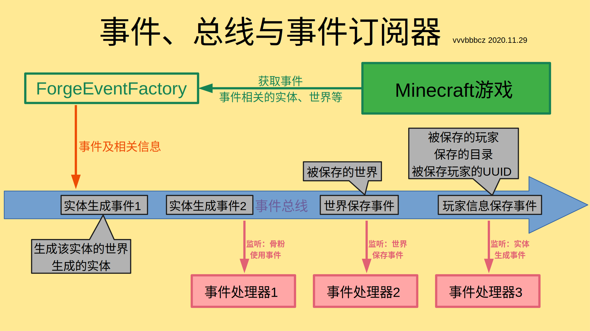

# 事件系统初步

事件系统是Forge Mod的核心，可以说整个Mod都是由事件驱动的。

在开始之前，我们需要了解以下几点：

* 事件系统是由Forge提供的，原版没有。
* 借助事件系统，可以开发出很强大的Mod。
* 拥有事件系统是Forge与其他Mod API最明显的区别。

了解事件系统，我们需要弄清楚三个概念：**事件 (event)**、**总线 (bus)**、**事件订阅器 (event subscriber)**。

**『事件』**就是『发生了什么事』，例如：方块破坏、生物死亡事件，又或者是方块/物品注册，甚至是客户端渲染……等等，都算事件。Forge的事件主要放在**`net/minecraftforge/event`**包内。

**『总线』**就是用来传输数据的。事件总线，就是用来传输事件及与该事件相关的数据的。以『实体跳跃事件』为例，当实体跳跃时，与这次跳跃相关的数据 (相关的实体、实体所在的世界等) 就会被发送到总线上，由总线传输这些数据到对应的事件订阅器。

**『事件订阅器』**又叫**『事件处理器』**，就是订阅了某个事件的函数，用于处理这个事件。例如：订阅玩家起床事件，在事件发生时将玩家传送到(0,0,0)的位置，这里我用一段示例代码演示。

```java
@Mod.EventBusSubscriber // 表明该类订阅了事件，默认为Forge总线，在后面加上(bus = Mod.EventBusSubscriber.Bus.MOD)可将其更改为Mod总线
public class xxxxx {
	@SubscribeEvent // 表明该函数是一个事件处理器，订阅了某个事件。还有另一种订阅事件的方法，在3.1章节会讲到
	public static void xxxxx(final PlayerWakeUpEvent event) { // 表明该事件处理器订阅了PlayerWakeUpEvent（玩家起床事件）
	// 当事件发生时你要做的事情，下面是一个示例
	PlayerEntity player = event.getPlayer(); // 获取总线传输过来的玩家信息
	player.setPosition(0, 0, 0); // 将玩家传送到坐标(0,0,0)
	}
}
```

这样，我们就在玩家起床时将其传送到了坐标(0,0,0)的位置。

三者的关系可以用以下图片表示。

