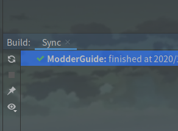

# 工作环境搭建

工作环境的搭建是一切的开始。工作环境的搭建，对于初学者来说是比较有挑战性的，也是最容易失败的。

## 相关软件安装

在搭建工作环境之前，我们需要先安装相关的软件。

首先就是JDK，JDK的安装没什么好讲的。只不过需要注意：**当前的Forge仅支持JDK 8**。

然后就是IDE，一般的Java书籍可能会选择Eclipse作为IDE，但我们为了Mod开发效率，建议选择**IDEA**作为IDE，请读者自行到[IDEA官网](https://www.jetbrains.com/)下载。

最后就是Forge Mdk，到[Forge官网](http://files.minecraftforge.net/)下载即可。这里建议选择**稳定版本 (Recommended)**，本文使用的是32.2.0。下载完成后记得**解压**，**解压路径不要包含中文、空格、感叹号等特殊字符**。  


至此，开发所需的软件，我们已经安装完毕，可以开始配置了。

## 修改工作环境配置文件

在开始之前，我们要先修改工作环境配置文件，即**`build.gradle`**文件。

我们先打开它 (尽量用**Notepad++**之类的工具打开，不要用记事本)，找到以下几行：(大约第16～18行)

```java
version = '1.0'
group = 'com.yourname.modid'
archivesBaseName = 'modid'
```

根据自身情况修改。

如果搞不懂，可以查看以下内容：

<details markdown='1'><summary>Version 【点击展开】</summary>
    <p><code>version</code>即版本号，如果你不知道怎么填，可以参考一个叫<strong>『<a href="http://semver.org/lang/zh-CN/">语义化版本</a>』</strong>的标准。</p>
</details>
<p></p>
<details markdown='1'><summary>Group 【点击展开】</summary>
    <p><code>group</code>即组id，通常使用Java包命名规范。这个字段的填写与你的网站有关，比如你的网站是github.com，那么你的组id就是：</p>
    <pre><code>com.github.&lt;your_username&gt;.&lt;your_project_name&gt;</code></pre>
    <p>我的网站是<a href="https://bzstudio.xyz">bzstudio.xyz</a>，则是：</p>
    <pre><code>xyz.bzstudio.modderguide</code></pre>
    <p>如果你没有网站，也可以用自己的用户名：</p>
    <pre><code>&lt;your_username&gt;.&lt;your_project_name&gt;</code></pre>
    <p>对于本教程，则是：</p>
    <pre><code>vvvbbbcz.modderguide</code></pre>
</details>
<p></p>
<details markdown='1'><summary>Mod ID 【点击展开】</summary>
    <p>即Mod的唯一标识符，一般写作modid。用于识别Mod，以及与其他Mod的区分。</p>
    <p>需要注意一下几点：</p>
        <ul><li>modid必须为全小写，不能使用除小写字母和下划线以外的其它符号。且modid不得超过64个字符。</li></ul>
        <ul><li>在Mod发布后，就不能轻易改动modid，因为其他Mod都是根据modid来识别的。Minecraft也是根据modid识别的，随意改变modid不仅会对与你的Mod有联动的Mod造成影响，而且还会影响到玩家。</li></ul>
    <p>而<code>archivesBaseName</code>则是Mod最终导出的文件名</p>
</details>


### 修改Mappings版本

再找到以下这行：(大约第28行)

```java
mappings channel: 'snapshot', version: '20200514-1.15.1'
```

mappings版本，其实就是**MCP版本**。**MCP版本越新越好，因为越新的版本意味着更准确的MCP Name，以及更少的类似`func_xxxxxx_x`的结构的方法。**

MCP版本号分两种：

* stable - 即**正式版**。版本号格式为`stable_XX`。
* snapshot - 即**快照版**，每天晚上更新。版本号格式为`YYYYMMDD-MCVersion`。

我们推荐用`stable`，但由于1.15.2还没有`stable`，因此只能用`snapshot`，版本号格式为**YYYYMMDD-MCVersion**。

接下来，我们要修改mappings版本。

首先，到**[Forge的maven库](https://files.minecraftforge.net/maven/de/oceanlabs/mcp/mcp_snapshot/)**，点击 “Show all Versions” ，然后翻倒最底，找到**最新的版本号** (编写教程时，最新版本号为20200901)，旁边有个小虫子的图标，鼠标指过去，可以看到对应的Minecraft版本为1.15.1 (若你看到的版本高于1.15.2，请自觉往上翻，找到对应1.15.2的最新版)。  


这样，我们获取到的mappings版本则为**`20200901-1.15.1`**，将原先的`20200514-1.15.1`替换即可。

**注：mappings版本在小版本之间可以通用，例如1.14.3的mappings可以用于1.14.4。**

### 修改Manifest信息

找到以下几行：（第115～127行）

```java
jar {
	manifest {
		attributes([
			"Specification-Title": "examplemod",
			"Specification-Vendor": "examplemodsareus",
			"Specification-Version": "1",
			"Implementation-Title": project.name,
			"Implementation-Version": "${version}",
			"Implementation-Vendor" :"examplemodsareus",
			"Implementation-Timestamp": new Date().format("yyyy-MM-dd'T'HH:mm:ssZ")
		])
	}
}
```

根据自己的情况修改即可。

## 开始配置

修改完配置文件，接下来就要开始配置了。这一步可能是Mod开发中最艰难的一步，由于网络原因，这一步极易失败，很多初学者就是在这时被劝退的。

我们打开Forge Mdk压缩包里的**`README.txt`**，然后根据自己的IDE，照着上面的做即可。如果使用Eclipse，在最后出现**`BUILD SUCCESSFUL`**，说明工作环境配置成功，如果最后出现**`BUILD FAILED`**则代表配置失败，此时请重新配置。如果你使用IDEA，你需要打开`build`面板，等待左侧显示绿色小钩。  


由于网络问题，配置可能会极慢。因此，有条件的读者建议使用国外的代理或其他工具。如果你没有代理，建议使用**[ForgeGradleCN](https://v2mcdev.com/t/topic/589)**或**[离线包](https://v2mcdev.com/t/topic/249)**。其次，还有zzzz提供的代理可以选择 (我不知道这个代理还是否可用)。(引用内容有删改)

> 在此我们提供了一个免费Shadowsocks代理服务器来帮助您构建. 注意此代理只能用来构建Forge无法访问其他墙外网站:
>
> > **server:** forge-build-srar-telecom.ustc-zzzz.net
> > **server_port:** 65099
> > **password:** 9c4d5a9a6d97
> > **method:** rc4-md5
>
> Shadowsocks客户端默认监听`127.0.0.1:1080`作为代理服务来运行。
>
> > 推荐使用的Shadowsocks客户端：https://github.com/shadowsocks/shadowsocks-windows/releases

### 设置代理

Eclipse的设置比较简单，直接在命令行末尾加上如下参数即可：

* 针对Socks代理：`-DsocksProxyHost=<主机名> -DsocksProxyPort=<端口号>`
* 针对Http代理：`-Dhttps.proxyHost=<主机名> -Dhttps.proxyPort=<端口号>`
* 针对Https代理：`-Dhttp.proxyHost=<主机名> -Dhttp.proxyPort=<端口号>`

如果是IDEA，只要打开Settings，在左上角的搜索框里输入`proxy`，即可找到相应的设置。

## 完成之后

在配置完成后，先不要直接开始，先点击左上角 (Eclipse) 或右上角 (IDEA) 的运行按钮，尝试启动一下Minecraft。顺便看看`External Libraries`，里面的库是否正常。  


#### 启动极慢的解决方案

你或许会发现启动很慢，这是因为Forge1.13+使用了联网的方式启动，因此你可以参阅[纪华裕的方法](https://v2mcdev.com/t/topic/304)。