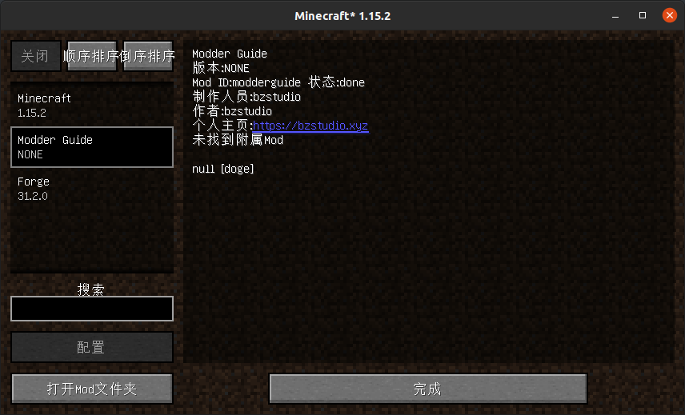

# 主类与Mod信息


## Mod主类

Forge在初始化时，会查找所有带有**`@Mod`**注解的类，并加载他们。带有`@Mod`注解的类，我们称为Mod的**『主类』**。一个Mod至少要有一个主类。

### 最基本的主类

我们先打开`src/main/java`，可以看到里面有一个叫`ExampleMod.java`的文件，这是Forge的**示例Mod**。在文档缺失的时候，`ExampleMod.java`就是我们的开发文档，通过阅读它，我们可以快速了解Mod的开发。读者可以尝试阅读。

如果读不懂也没关系，直接删掉即可，我们稍后会讲到。

我们将ExampleMod的所有包都删掉。然后创建自己的类包。**包名要与`build.graldle`里的`group`字段相同**，这一点不是必要的，但为了开发的**规范性**，我们还是需要遵守。**其次，Java包名要使用全小写**。本文为`xyz.bzstudio.modderguide`。

然后创建一个类，类名为Mod名，本文为`ModderGuide.java`。关于类名，需要注意的是：**Java类名要使用大写驼峰**，也就是将每个单词首字母大写再去掉空格后的形式。

然后在类声明前面加上**`@Mod`**注解，并填入你的modid。

但是为了以后的开发方便，我们建议将modid独立出来，变成一个常量。

然后我们的主类将会变成这样：

```java
@Mod(ModderGuide.MODID)
public class ModderGuide {
    public static final String MODID = "modderguide";
}
```

这样的主类已经可以运行了，但还不够完整。我们先向主类添加一个**构造函数**，让Forge在初始化的时候执行。然后放在那儿，我们待会要用到。

### 完善Mod的主类

然后我们要监听一些**Mod总线**上一些与初始化有关的事件，用于以后的开发。

我们向Mod主类添加以下事件的事件处理器：

<details markdown='1'><summary>FMLCommonSetupEvent 【点击展开】</summary>
    <p>通用初始化事件，这是Mod开发中最常用、最重要的，几乎每个Mod都需要监听。</p>
</details>
<p></p>
<details markdown='1'><summary>FMLClientSetupEvent 【点击展开】</summary>
    <p>客户端初始化事件，在更改方块渲染类型、注册实体模型中需要用到，也是很重要的事件。</p>
</details>
<p></p>
<details markdown='1'><summary>FMLServerStartingEvent (可选) 【点击展开】</summary>
    <p>服务端启动事件，在服务端启动时执行，用于服务端操作，较少用到。</p>
</details>
<p></p>
<details markdown='1'><summary>InterModEnqueueEvent (可选) 【点击展开】</summary>
    <p>用于Mod间通讯，极少用。</p>
</details>
<p></p>
<details markdown='1'><summary>InterModProcessEvent (可选) 【点击展开】</summary>
    <p>用于Mod间通讯，极少用。</p>
</details>


<p></p>

这些是最基本的事件，在以后的开发中，我们还会添加更多事件。

然后我们还要向构造函数里添加事件监听：

```java
// getModEventBus()方法表明这是向Mod总线添加监听
FMLJavaModLoadingContext.get().getModEventBus().addListener(this::xxxxx);
```

还要向事件总线注册：

```java
MinecraftForge.EVENT_BUS.register(this);
```

然后我们的主类就变成了这样 (我这里添加了注释)：

```java
// Forge在加载Mod时，会自动寻找含有@Mod注解的类，并将其作为Mod的主类，然后加载主类的构造函数
@Mod(ModderGuide.MODID)
public class ModderGuide {
    public static final String MODID = "modderguide"; // 将modid独立出来，方便以后的开发

    public ModderGuide() { // 主类的构造函数
        // getModEventBus()方法表明这是向Mod总线添加监听
        FMLJavaModLoadingContext.get().getModEventBus().addListener(this::setup);
        FMLJavaModLoadingContext.get().getModEventBus().addListener(this::enqueueIMC);
        FMLJavaModLoadingContext.get().getModEventBus().addListener(this::processIMC);
        FMLJavaModLoadingContext.get().getModEventBus().addListener(this::doClientStuff);
        FMLJavaModLoadingContext.get().getModEventBus().addListener(this::onServerStarting);

        MinecraftForge.EVENT_BUS.register(this);
    }

    private void setup(final FMLCommonSetupEvent event) { // 监听服务端初始化事件
    }

    private void doClientStuff(final FMLClientSetupEvent event) { // 监听客户端初始化事件
    }

    private void onServerStarting(final FMLServerStartingEvent event) { // 监听服务端启动事件
    }

    // 监听IMC事件，这两个函数主要用于Mod间发送信息
    private void enqueueIMC(final InterModEnqueueEvent event) {
    }

    private void processIMC(final InterModProcessEvent event) {
    }
}
```

但即使我们的主类已经足够完整，但我们的Mod还不能运行，因为我们还没有修改Mod信息文件，里面的modid还是『examplemod』，与我们的主类不匹配。

## 修改Mod信息

打开`src/main/resources`，我们的Mod信息文件就放在里面，这个文件夹同时也是存放材质文件的地方。

我们先打开`pack.mcmeta`，如果你制作过材质包，你应该对此非常熟悉。我们修改相应的信息。至于**`pack_format`**部分的数值，这是目录结构的版本，**这里不要修改**。(其实这里没有修改的必要，但我建议还是修改一下)

然后就是最重要的`mods.toml`文件。这个文件的编辑不需要什么技术，自己根据注释修改即可。后面标有`#mandatory`的为必填项，后面标有`#optional`的为选填项。如果你不想填选填部分，请在前面加个`#`，将其注释掉。 (如果你使用IDEA，推荐安装一个插件：Toml，在设置里即可安装)

**注意：version不要修改！在构建时Forge会自动将其替换为build.gradle里的version。**

至此，我们的Mod信息就修改完毕了，启动游戏试试吧！

