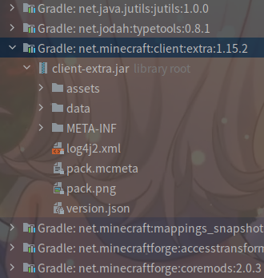
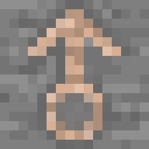
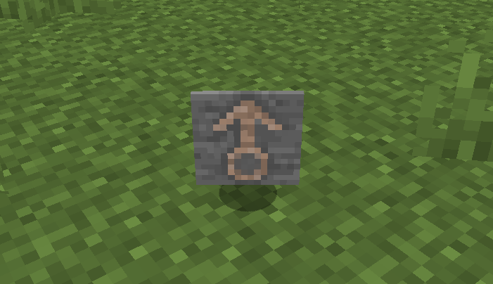

# 物品的模型与材质

我们在上一节创建了我们自己的物品，但这个物品还只是一个紫黑块。在这节，我们将为其加入材质。(如果你之前创作过材质包，应该会对本章内容非常熟悉)

Minecraft的模型与材质都放在jar文件里的`assets.minecraft`包内。**但是，Minecraft的`assets`与代码在不同的jar类库中，如下图。**  


模型，顾名思义，就是物品的形状。而材质，大家都懂，我就不解释了。**我们需要先创建物品的模型，才能为其添加材质。**

## 开始添加模型

在开始之前，我们可以先浏览`assets/minecraft`下的目录，了解一下Minecraft资源包的目录结构。

因为我们的物品是一个『简单物品』，因此不我们也需要多复杂的模型，只要一个扁平的贴图即可。因此，我们可以直接复制原版的模型并进行修改。例如原版的铁锭、钻石剑等。

因为Minecraft会从`assets/<modid>/models/item`读取物品模型，因此我们在`src/main/resources`下创建`assets/modderguide/models/item`。然后创建文件`<物品ID>.json`，本文则为`test_item.json`。

我们直接参照铁锭的模型，我这里先把铁锭模型的代码贴出来。

```json
{
    "parent": "item/generated", // 要修改的部分
    "textures": {
        "layer0": "item/iron_ingot" // 要修改的部分
    }
}
```

首先第二行`"parent"`，也就是这个模型的**父模型**，表明该模型继承于`item/generated`，但这个`item/generated`是Minecraft提供的，因此我们需要在前面添加`minecraft:`，改为**`minecraft:item/generated`**。即使我们不添加，Minecraft也会默认从`assets/minecraft`下加载模型，但我们最好还是加上去，养成良好的代码习惯。

这里的`minecraft:item/generated`最前面的『`minecraft`』表示下面的内容在`minecraft`这个**命名空间 (Namespaces)**内。这样，Minecraft将会从`assets/minecraft`下加载模型。每一个Mod都有自己的命名空间，即这个Mod的modid。

其次是第四行`"layer0"`，这是材质的目录。我们将其改成`modderguide:item/test_item`即可。

当然，我们仅仅创建了一个简单的模型，如果我们需要创建更加复杂的模型呢？我们只需要用第三方建模软件即可。网上的建模软件有很多，我自己用的是[Blockbench](https://blockbench.net/) (不是恰饭)。

## 添加材质

Minecraft的**物品材质**主要放在`assets/minecraft/textures/item`下。因此，我们的材质也要放在相应的位置。**这里需要注意：Minecraft仅支持png格式的图片。**

下图就是我们的材质了，也就是我的头像！  


## 启动游戏测试

启动游戏，可以看到我们的物品已经有了~~漂亮的~~材质了，启动游戏试试吧！  


如果材质不能正常显示，可能是哪个步骤有问题，或是拼写错误，请你自己阅读日志进行解决。作为开发者，一定要学会分析日志。