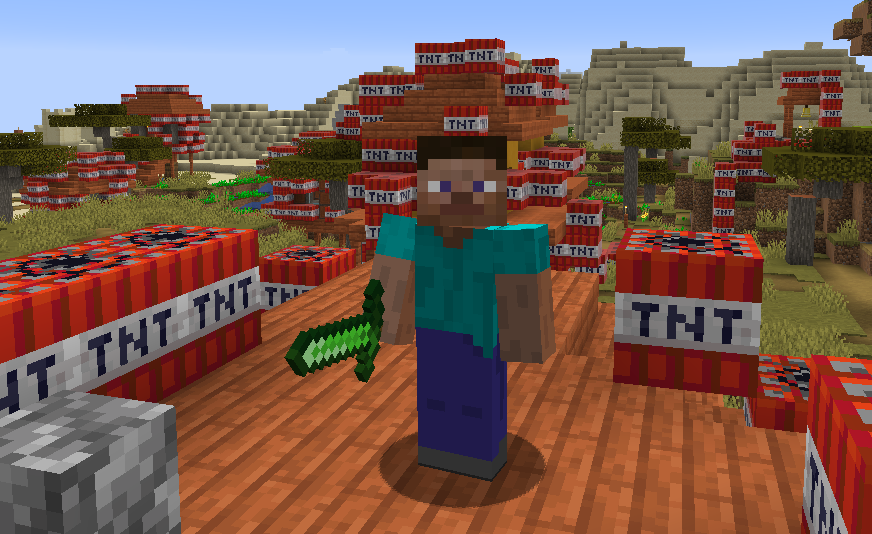
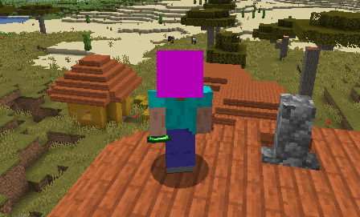

# 工具、武器、护甲与食物

我们在先前的章节中创建了一个~~没用的~~物品，那这一节就来创建一些有用的物品。

---

## 工具与武器

Minecraft有铁剑、金剑、钻石剑，但是却偏偏没有绿宝石剑。因此，我在这里将会以绿宝石剑为例，教读者打造工具与武器。

与先前一样，创建一个常量。

```java
public static final RegistryObject<Item> EMERALD_SWORD = ITEMS.register("emerald_sword", () -> {
	return new SwordItem(...);
});
```

可以发现，我们这次不再是`new Item()`了，而是**`new SwordItem()`**了。要求填入的参数也不止`Properties`了，而是`(IItemTier tier, int attackDamageIn, float attackSpeedIn, Item.Properties builder)`，后三个参数你应该知道是什么意思，如果不知道填什么的可以参阅源代码 (**提示：按住Ctrl，试试点击相关的类**)，那我们就着重讲解第一个——`ItemTier`。

通过参阅源代码，我们可以发现，原版的工具都是填入`ItemTier.<material>`。而ItemTier是个**枚举类**。因此，我们如果想添加自己的ItemTier，只能模仿`ItemTier`，自己**继承`IItemTier`接口**，写一个与`ItemTier`一样的枚举类。

因此，我参照了原版的`ItemTier`，自己写了一个枚举类，代码如下。

**`src/main/java/xyz/bzstudio/modderguide/item/MGItemTier.java`**：

```java
public enum MGItemTier implements IItemTier {
	EMERALD(3, 2333, 7.0F, 2.0F, 9, () -> Ingredient.fromItems(Items.EMERALD));

	private final int harvestLevel;
	private final int maxUses;
	private final float efficiency;
	private final float attackDamage;
	private final int enchantability;
	private final LazyValue<Ingredient> repairMaterial;

	MGItemTier(int harvestLevelIn, int maxUsesIn, float efficiencyIn, float attackDamageIn, int enchantabilityIn, Supplier<Ingredient> repairMaterialIn) {
		this.harvestLevel = harvestLevelIn;
		this.maxUses = maxUsesIn;
		this.efficiency = efficiencyIn;
		this.attackDamage = attackDamageIn;
		this.enchantability = enchantabilityIn;
		this.repairMaterial = new LazyValue<>(repairMaterialIn);
	}

	@Override
	public int getMaxUses() {
		return this.maxUses;
	}
	
	@Override
	public float getEfficiency() {
		return this.efficiency;
	}

	@Override
	public float getAttackDamage() {
		return this.attackDamage;
	}

	@Override
	public int getHarvestLevel() {
		return this.harvestLevel;
	}

	@Override
	public int getEnchantability() {
		return this.enchantability;
	}

	@Override
	public Ingredient getRepairMaterial() {
		return this.repairMaterial.getValue();
	}
}
```

然后，自行将代码补充完毕，再加入模型与材质，我们的绿宝石剑就做好了，打开游戏试试吧！  


---

## 护甲

护甲的创建与工具、武器类似，**但在材质方面还是比较特殊**。

例如，我们已经按创建工具、武器的方法创建好了一个绿宝石头盔。但如果读者尝试把它戴在头上时，会发现**戴着的只是一个紫黑块**。  


那这样怎么解决呢？读者可以浏览一下**`assets/minecraft/textures/models/armor`**下的图片，就会明白为什么玩家只会戴着紫黑块了。

我们可以看到，在该目录下的图片都是以`<material_name>_layer_<1/2>.png`的方式命名的，其中`<material_name>`就是读者创建`ArmorMaterial`的时候填入的参数**`name`**。其余的部分读者应该自己可以搞懂。

但当我们打开游戏，会发现我们的材质**还是没有正常显示**。让我们翻阅日志，就会发现这样一句话：

```
[22:00:13] [Render thread/WARN] [minecraft/TextureManager]: Failed to load texture: minecraft:textures/models/armor/emerald_layer_1.png
```

想必读者应该明白了：**Minecraft并没有到我们自己的资源包目录下加载贴图。**换言之，就是我们没有指定材质的命名空间。**因此，我们只需要将`<material_name>`改为`<modid>:<material_name>`即可解决问题**。

或许，读者还可以将其**写进枚举类的`getName()`方法**，以后就不用手动添加modid了。

**`src/main/java/xyz/bzstudio/modderguide/item/MGArmorMaterial.java (部分)`**：

```java
@OnlyIn(Dist.CLIENT)
public String getName() {
	return ModderGuide.MODID + ":" + this.name;
}
```

打开游戏，就可以看到我们的护甲材质已经正常显示出来了。  


---

## 食物

Minecraft中有蘑菇煲、兔肉煲、甜菜根汤，为什么就没有鱼肉汤？因此，下文以鱼肉汤为例，教读者制作食物。

首先，就是食物的实例，只是一个普通的`Item`：

```java
public static final RegistryObject<Item> FISH_SOUP = ITEMS.register("fish_soup", () -> {
	return new Item(new Item.Properties().group(ItemGroup.FOOD).food(...));
});
```

我们可以看到，食物相比普通物品，不仅指定了`group`，还指定了`food`。通过**参考Minecraft源代码**，我们发现，原版食物填入的是`Foods.<food>`。因此，我们也仿照Minecraft的方式，添加一个`food`。

```java
public static final Food FISH_SOUP = (new Food.Builder()).hunger(8).saturation(0.6F).build();
```

`hunger`指饱食度，`saturation`则是饱和度。关于饱和度，不懂的读者可以参阅以下内容：

> **食物饱和度（foodSaturationLevel）**：它表示玩家目前的饱和度等级，决定了饥饿度下降的速度，吃不同种类的食物补充的饱和度不同。这是一项隐藏的食物变量，这个变量的值是无法超过食物水平的，其初始值为5。当饱和度降至0时，饥饿条会规律地颤抖。
> 
> *原文：[Minecraft Wiki](https://minecraft-zh.gamepedia.com/%E9%A5%A5%E9%A5%BF)*

实际上，Food不仅可以指定食物的饱食度，还可以指定吃完食物后玩家获得的药水效果等，**这些由读者自己摸索**。

再添加模型、材质，我们的食物就做好了，先打开游戏试试吧！

### 一些细节性问题

虽然我们的鱼肉汤做好了，但还是有一个细节，就是**当玩家食用完鱼肉汤时，并不会把碗还给玩家**。显然，我们喝汤不可能把碗也一起吃下去。因此，我们要**覆写`onItemUseFinish(...)`方法**，在玩家食用完鱼肉汤时，还给玩家一个碗。

Minecraft中已经有一个类覆写好了，**那就是`SoupItem`**，我们只需要**将物品实例中的`new Item(...)`换成`new SoupItem(...)`**即可。

启动游戏，当我们把食用完鱼肉汤后，就会自动把碗还给我们了。