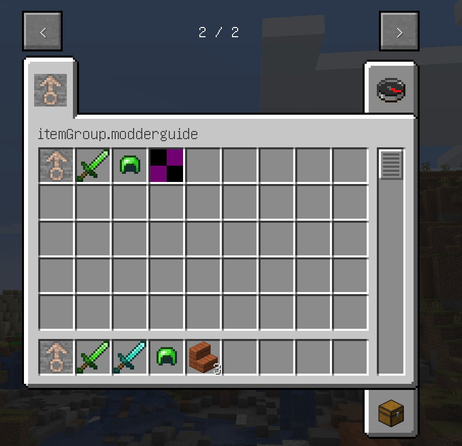

# 创造模式物品栏

我们先前创建了一些物品，使用了Minecraft的`ItemGroup`。那本节，我们就来创建自己的`ItemGroup`。

我们先阅读`net.minecraft.item.ItemGroup`，了解Minecraft是如何创建`ItemGroup`的，接下来按照Minecraft的方式，先尝试自己创建`ItemGroup`，我相信你应该可以成功的。如果不成功，再来看下面的教程。

首先，创建自己的ItemGroup类，本文为`MGItemGroup`，然后新建一个**常量**，代码如下：

**`src/main/java/xyz/bzstudio/modderguide/item/MGItemGroup.java (部分) `**：

```java
public static final ItemGroup XXXXX = new ItemGroup(label) {
	@Override
	public ItemStack createIcon() {
		return xxxxx;
	}
};
```

首先就是`label`，它相当于这个`ItemGroup`的ID。其次是`createIcon()`方法，就是这个物品栏的**图标**，要求返回一个**`ItemStack`**，关于`ItemStack`，我们会在**3.2.5章节**讲到。你现在只需要知道`new ItemStack(<item>)`即可。

然后，将相应物品的`ItemGroup`换成我们自己的，我们的物品栏就完工了，启动游戏试试吧！  


~~(那个紫黑块是鱼肉汤，我懒得画材质了)~~