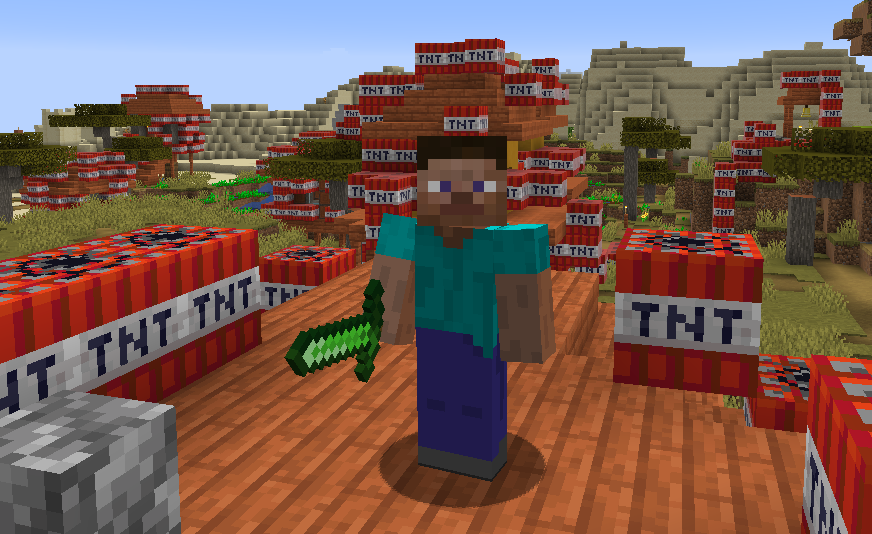

# 工具、武器、护甲与食物

我们在先前的章节中创建了一个~~没用的~~物品，那这一节就来创建一些有用的物品。

---

## 工具与武器

Minecraft有铁剑、金剑、钻石剑，但是却偏偏没有绿宝石剑。因此，本部分将会以绿宝石剑为例，教读者打造工具与武器，**至于斧头、镐子等工具，也是一样的**。

### 创建工具的实例与ItemTier

与先前一样，创建一个常量。

```java
public static final RegistryObject<Item> EMERALD_SWORD = ITEMS.register("emerald_sword", () -> {
	return new SwordItem(...);
});
```

可以发现，我们这次不再是`new Item()`了，而是**`new SwordItem()`**了。要求填入的参数也不止`Properties`了，而是`(IItemTier tier, int attackDamageIn, float attackSpeedIn, Item.Properties builder)`，后三个参数读者应该知道是什么意思，如果不知道填什么的可以参阅源代码（**提示：按住Ctrl**），那我们就着重讲解第一个——ItemTier。

通过参阅源代码，我们可以发现，原版的工具都是填入`ItemTier.<material>`，而ItemTier是个**枚举类**。因此，我们如果想添加自己的ItemTier，就只能自己继承**`IItemTier`接口**，写一个与`ItemTier`一样的枚举类。

因此，参照原版的`ItemTier`，自己写一个枚举类，本文为`MGItemTier`。

然后，自行将参数补充完毕，再自己加入模型与材质，我们的绿宝石剑就做好了，打开游戏试试吧！  


---

## 护甲

护甲的创建与工具、武器类似，但在材质方面还是比较特殊。

例如，我们已经创建好了一个绿宝石头盔。但如果读者尝试把它戴在头上时，会发现**戴着的只是一个紫黑块**。

那这样怎么解决呢？读者可以浏览一下**`assets/minecraft/textures/models/armor`**下的图片，就会明白为什么玩家只会戴着紫黑块了。

我们可以看到，在该目录下的图片都是以`<material_name>_layer_<1/2>.png`的方式命名的，其中`<material_name>`就是读者创建`ArmorMaterial`的时候填入的参数**`name`**。其余的部分读者应该自己可以搞懂。

但当我们打开游戏，会发现我们的材质还是没有正常显示。让我们翻阅日志，就会发现这样一句话：

```
[22:00:13] [Render thread/WARN] [minecraft/TextureManager]: Failed to load texture: minecraft:textures/models/armor/emerald_layer_1.png
```

想必读者应该明白了：**Minecraft并没有到我们自己的资源包目录下加载贴图。**

这是什么问题呢？其实是`<material_name>`的问题。我们填入的仅仅是一个简单的ID，而前面如果不带modid，就会被认为是Minecraft的，从而在Minecraft的资源包目录下加载。

因此，我们只需要将`<material_name>`改为`modid:<material_name>`即可解决问题。

或许，读者还可以将其写进枚举类的`getName()`方法，以后就不用手动添加modid了。

`src/main/java/com/github/vvvbbbcz/modderguide/item/MGArmorMaterial.java（部分）`：

```java
@OnlyIn(Dist.CLIENT)
public String getName() {
	return ModderGuide.MODID + ":" + this.name;
}
```

打开游戏，就可以看到我们的护甲材质已经正常显示出来了。  


---

## 食物

九月5日晚将会更新...