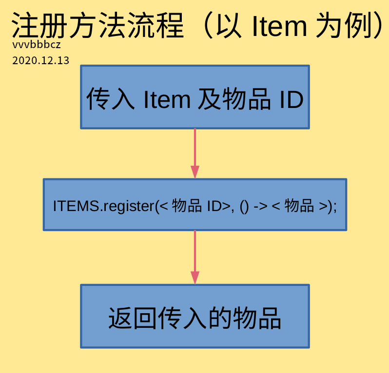

# 实例注册问题详解

我们在**3.2.1章节**就讲过，注册物品/方块有两种方法。我们目前使用的是DeferredRegister，也就是第一种方法，在这种方法中，物品/方块的实例都是一个`RegistryObject`，这在不合适的时机调用就会引发空指针异常。

但不合适的时机是指什么时候？合适的时机又是指什么时候？

## DeferredRegister详解

### get()的调用时机与相关问题

在实例完成注册之前，我们调用`get()`方法，返回的是`null`，因此在此时调用会引发空指针异常。也就是说，在实例完成注册之前调用，便是不合适的时机。而在实例完成注册之后，便是合适的时机。

但我并不知道实例何时完成注册，那怎么判断呢？总之，**一般在`FMLCommonSetupEvent`事件之前，统称为不合适的时机；在该事件之后，统称为合适的时机。**

**但这样也引发了一些问题**。我遇到过最典型的便是向生物群系添加生物生成的问题。因为Minecraft的实例注册是有顺序的，比如：**先注册方块，再注册物品，先注册生物群系，再注册实体**。生物群系和实体生物也一样需要注册。生物群系中提供了一个叫`addSpawn()`的方法，即向生物群系添加生物生成，里面要求传入一个实体的实例。这个方法一般在生物群系的构造函数中调用，**也就是在注册生物群系时会被调用**。但无论你怎么搞，只要传入的实体是使用`get()`方法得到的，**都会引发空指针异常**。

这是为什么呢？因为Minecraft是**先注册生物群系，再注册实体的**。在注册生物群系时就调用了`addSpawn()`方法，进而调用了开发者传入的实体实例的`get()`方法。**但此时实体还没被注册，因此`get()`方法获取到的是`null`**，引发了NPE。

### 如何解决这些问题

首先，分析我们刚刚遇到的问题。引发空指针异常，就是因为调用实体实例的`get()`方法获取到的是`null`。因此，**我们只要确保`get()`方法获取到的不是`null`即可**。或者是说，我们直接不用`get()`，而是直接把先前的`RegistryObject`类型的实例换成`Item`或`Block`，问题不久解决了吗？

我当时参考了Minecraft的注册方式。Minecraft是写了一个叫`register`的方法，虽然表面上只是返回`Registry.register(...)`方法，但分析代码，就会发现他们最终都直接返回传入的`Item`/`Block`。因此，我们也可以参考Minecraft的写法，编写一个类似的方法。方法的具体流程如下：



因此，我们编写了一个这样的方法：

**`src/main/java/xyz/bzstudio/modderguide/block/MGItems.java (部分) `**：

```java
private static Item register(String name, Item item) {
	ITEMS.register(name, () -> item);
	return item;
}
```

那么我们的物品实例就变成了这样：

**`src/main/java/xyz/bzstudio/modderguide/block/MGBlocks.java (部分) `**：

```java
	public static final Item TEST_ITEM = register("test_item", new Item(new Item.Properties().group(MGItemGroup.MODDERGUIDE)));
	public static final Item TEST_BLOCK = register("test_block", new BlockItem(MGBlocks.TEST_BLOCK, new Item.Properties().group(MGItemGroup.MODDERGUIDE)));
```

对于方块，还有以后会学的实体、TileEntity等等，都是一样的道理。

## 事件监听法详解

注册实例还有另一种方法——**事件监听法**，这种方法通过监听`RegistryEvent`来实现实例的注册。它不及DeferredRegister方便，且相较于DeferredRegister，事件监听法有时会出现一些更难解决的问题。因此不推荐使用，但我们还是要了解，因为有的元素 (例如新的维度) 的注册依然只能用事件监听法完成注册。

待更新。。。