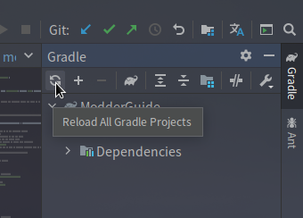

# 更新Forge与Mappings

为了适应新版本，我们在开发过程中会时不时地更新Forge与MCP映射表。

## 更新Forge

我们可以在`build.gradle`文件下找到这一行：(约第92行)

```java
minecraft 'net.minecraftforge:forge:1.15.2-31.2.0'
```

这里的`1.15.2-31.2.0`就是Forge版本，自己修改成需要的版本，然后点击右侧的Gradle面板的重新导入按钮，重新导入项目即可。  


可能需要下载一些文件，但一般不会太多。

## 更新Mappings

更新Mappings的方法，其实在搭建工作环境的时候就已经涉及到了，方法与修改Mappings版本的方法相同。修改完后，重新导入项目即可。